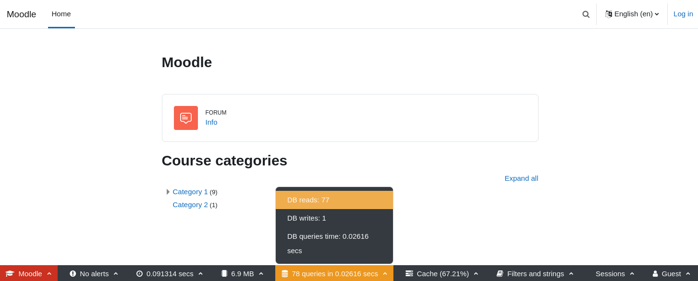
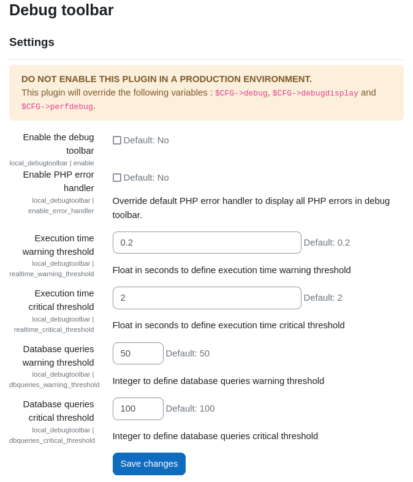

# local_debugtoolbar

## Description

Inspired by [the web debug toolbar](https://symfony.com/blog/new-in-symfony-2-8-redesigned-web-debug-toolbar) of [Symfony project](https://symfony.com/), the `local_debugtoolbar` reuses performance information from Moodle to display it in an always-visible toolbar at the bottom of the page.


## Installation

```bash
cd /your/moodle/path
git clone https://github.com/DSI-Universite-Rennes2/moodle-local_debugtoolbar local/debugtoolbar
php admin/cli/upgrade.php
```


## Configuration
After you have installed this local plugin, you should see a new option in the settings block:
> Site administration -> Plugins -> Local plugins -> Debug toolbar


## Screenshots




## Reporting security issues

We take security seriously. If you discover a security issue, please bring it
to their attention right away!

Please **DO NOT** file a public issue, instead send your report privately to
[foss-security@univ-rennes2.fr](mailto:foss-security@univ-rennes2.fr).

Security reports are greatly appreciated and we will publicly thank you for it.
